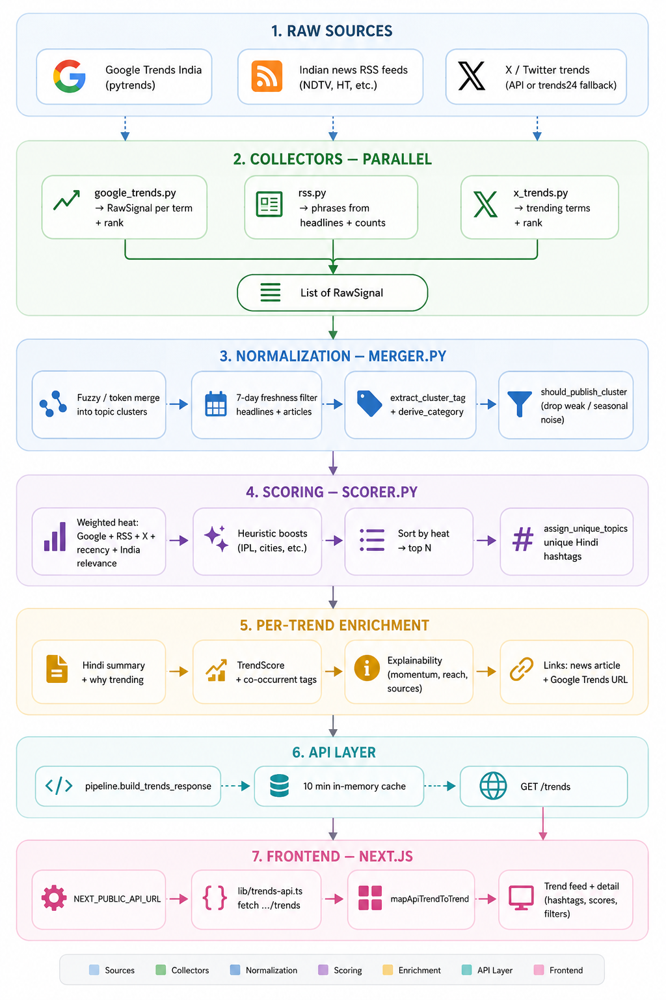

# ShareChat Trend Intelligence Engine

A lightweight trend intelligence engine built for Hindi-speaking Indian users.

The system automatically identifies what India is talking about right now by combining signals from Google Trends, Indian news feeds, and social trend discovery. The output is a ranked list of explainable Hindi trending tags designed for the ShareChat feed experience.

This project was built as part of the ShareChat APM assignment.


# 1. Problem Statement

Trending Tags are one of the highest-intent discovery surfaces on ShareChat.

They help users quickly understand what India is talking about and route them into relevant content journeys.

The challenge is that trends are fragmented across:

- search spikes,
- breaking news,
- social conversations,
- and external platform momentum.

Manual curation does not scale across India's linguistic and cultural diversity.

The goal of this project was to build a lightweight system that:

- automatically detects Indian trends,
- generates ranked Hindi hashtags,
- explains why each trend matters,
- and presents them in a mobile-first feed experience.


# 2. Product Thinking

Most trend feeds fail for three reasons:

- they are noisy,
- they prioritize global conversations over Indian relevance,
- and they provide no explainability.

This system was designed around a few product principles:

- India-first trend discovery
- explainable rankings instead of black-box outputs
- freshness over historical depth
- fast mobile consumption
- clustering duplicate conversations into a single story

The goal was not to build a perfect social graph engine.

The goal was to build a practical, explainable trend discovery system that could realistically power a lightweight ShareChat experience.


# 3. Architecture

The system follows a lightweight signal aggregation pipeline.

Multiple real-time sources are collected in parallel, normalized into unified topic clusters, ranked using heuristic scoring, enriched with explainability metadata, and served through a FastAPI backend.

The frontend consumes this data through a mobile-first Next.js interface.

### Workflow Diagram




## Stage-by-stage Breakdown

| Stage | Where | Input → Output |
|---|---|---|
| Collect | `backend/app/collectors/` | Live APIs + feeds → multiple `RawSignal` objects containing topic names, source metadata, ranks, headlines, RSS counts, and mentions |
| Merge | `backend/app/normalization/merger.py` | All signals → unified topic clusters with deduped headlines/articles, Hindi-friendly tags, categories, and freshness filtering |
| Score | `backend/app/scoring/scorer.py` | Each cluster → normalized heat score using Google rank, RSS volume, X mentions, recency, and India relevance |
| Unique Tags | `alternate_tag.py` | Duplicate hashtags → alternate tags using event → team → player priority logic |
| Package | `_draft_to_item` | Cluster → final `TrendItem` with hashtag, Hindi description, explainability, trend score, and metadata |
| Serve | `routes/trends.py` + `cache.py` | `GET /trends` returns cached JSON response (~10 min cache) |
| Display | `frontend/lib/trends-api.ts` | Frontend fetches trends → renders cards + detailed explainability views |


## Data Flow

1. Collect live trend signals from Google Trends, RSS feeds, and X/Twitter.
2. Convert them into normalized `RawSignal` objects.
3. Merge related signals into topic clusters.
4. Remove duplicates and stale topics.
5. Compute a weighted heat score.
6. Generate unique Hindi hashtags.
7. Package explainability metadata.
8. Serve ranked trends through the API.
9. Render trend cards in the frontend.


# 4. Trend Scoring Logic

The ranking system uses lightweight heuristic scoring instead of heavy ML models.

The goal was to keep ranking:

- transparent,
- debuggable,
- low latency,
- and easy to tune.

Each trend cluster receives a normalized heat score between `0 → 1`.

### Primary Signals

- Google Trends rank *(strongest single signal)*
- RSS/news mention count
- X/Twitter trend rank + mentions
- recency of latest headlines
- India relevance keywords

### Heuristic Boosts

Additional boosts are applied for categories that are disproportionately engagement-heavy in India:

- IPL/cricket
- elections
- festivals
- cities/weather
- major entertainment launches

After scoring:

1. trends are sorted by heat,
2. duplicate hashtags are resolved,
3. and the final top 10 trends are returned.


# 5. Explainability Features

A trend without context is low-value.

Each trend card includes:

- why the topic is trending,
- contributing sources,
- momentum indicators,
- related hashtags,
- trend confidence score,
- and supporting links.

The goal was to move beyond:

> "What is trending?"

into:

> "Why is this trending and why should users care?"


# 6. UX Rationale

The frontend was designed for fast, mobile-native trend discovery.

Key UI decisions:

- card-based feed instead of dense tables,
- large Hindi hashtags for quick scanning,
- explainability surfaced directly in cards,
- lightweight visual hierarchy,
- tap-through detail sheets for deeper context.

Several ideas were intentionally avoided:

- analytics-heavy dashboards,
- desktop-first layouts,
- infinite nested navigation,
- opaque AI-generated rankings.

The focus was speed, readability, and trust.


# 7. Tech Stack

## Backend
- Python
- FastAPI
- PyTrends
- RSS parsing
- heuristic scoring engine

## Frontend
- Next.js
- TypeScript
- Tailwind CSS

## Infrastructure
- Vercel (frontend)
- Render/Railway (backend)
- in-memory caching


# 8. Key Files

| Role | File |
|---|---|
| Orchestration | `backend/app/utils/pipeline.py` |
| Google Trends | `backend/app/collectors/google_trends.py` |
| News/RSS | `backend/app/collectors/rss.py` |
| X/Twitter | `backend/app/collectors/x_trends.py` |
| Clustering | `backend/app/normalization/merger.py` |
| Ranking | `backend/app/scoring/scorer.py` |
| API | `backend/app/routes/trends.py` |
| Frontend API Layer | `frontend/lib/trends-api.ts` |


# 9. Local Setup

## Backend

```bash
cd backend
pip install -r requirements.txt
uvicorn app.main:app --reload
```

Backend runs on:

```bash
http://localhost:8000
```

## Frontend

```bash
cd frontend
npm install
npm run dev
```

Create `.env.local`

```env
NEXT_PUBLIC_API_URL=http://localhost:8000
```

Frontend runs on:

```bash
http://localhost:3000
```

# 10. Deployment Links

## Frontend
- https://share-chat-apm-trends-o9nd.vercel.app/

## Backend API
- https://sharechat-apm-trends.onrender.com/trends

## Loom Walkthrough
- Add Loom link


# 11. Tradeoffs

This project intentionally prioritizes product clarity and speed of iteration over infrastructure complexity.

### Chosen Tradeoffs

- heuristic scoring instead of ML ranking
- lightweight caching instead of distributed systems
- RSS + Trends aggregation instead of full social ingestion
- explainability over pure engagement optimization

### What This Enables

- faster iteration,
- simpler debugging,
- lower infra cost,
- and transparent ranking logic.


# 12. Future Improvements

Given more time, the next improvements would likely be:

- personalized trend feeds
- multilingual trend generation
- creator-specific recommendations
- engagement prediction models
- sentiment analysis
- real-time streaming pipelines
- richer explainability analytics
- location-aware trends
- audio/video trend detection


# 13. GenAI Usage

GenAI tools were used during development for:

- architecture brainstorming,
- frontend scaffolding,
- workflow visualization,
- API iteration,
- and UI refinement.

The final system design, ranking logic, tradeoffs, and product decisions were manually curated and iterated.

